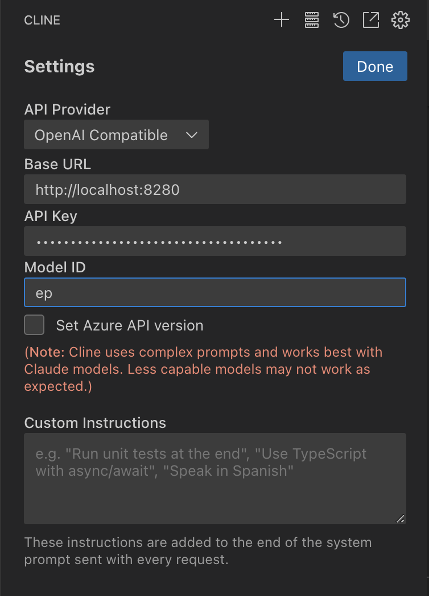

# 项目说明

CLINE是一个非常优秀的开源项目，可惜它不支持豆包大模型，这里搭建一个多模态的豆包服务供CLINE使用。

## 环境变量说明
本项目使用以下环境变量：
- `FIXED_TEXT_LONG_MODEL`: 豆包长文本模型endpoint。
- `FIXED_TEXT_MODEL`: 豆包文本模型endpoint。
- `FIXED_VERSION_MODEL`: 豆包视觉理解模型endpoint。
- `API_KEY`: 火山方舟API密钥。

你需要在运行项目前设置这些环境变量，例如在bash中可以使用以下命令设置：
```bash
export FIXED_TEXT_LONG_MODEL=your_long_text_model_name
export FIXED_TEXT_MODEL=your_text_model_name
export FIXED_VERSION_MODEL=your_image_model_name
export API_KEY=your_api_key
```
这里三个model分别为火山引擎的endpoint id
创建 endpint id 文档：https://www.volcengine.com/docs/82379/1099522
查看 endpint id 文档：https://www.volcengine.com/docs/82379/1182403
查看 apikey 文档：https://www.volcengine.com/docs/82379/1361424

## 运行程序
确保你已经安装了Go语言环境。在设置好环境变量后，在项目根目录下运行以下命令启动服务器：
```bash
go run main.go
```
服务器将在`:8280`端口启动。你可以通过访问`http://localhost:8280`来使用服务。


这样你的豆包服务启动成功了。

## 配置CLINE
点击 CLINE 的配置按钮，API Provider 选择 OpenAI Compatible， Base URL 填本地地址`http://localhost:8280`, API KEY和Model ID随便填写即可。

